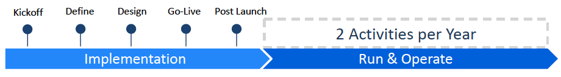
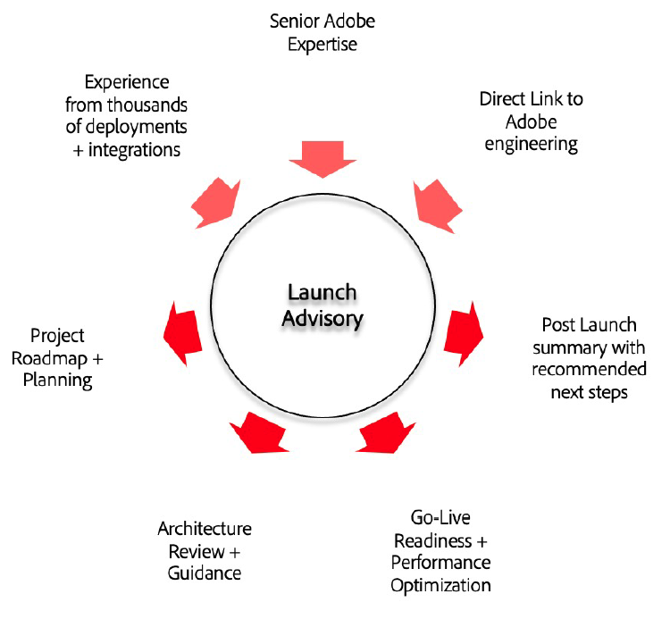

# Enterprise Support

<table>
<thead>
  <tr>
    <th></th>
    <th></th>
    <th>Online Support</th>
    <th>Enterprise Support</th>
  </tr>
</thead>
<tbody>
  <tr>
    <td></td>
    <td></td>
    <td>Included with Subscription</td>
    <td>Paid Support ($)</td>
  </tr>
  <tr>
    <td rowspan="3">Assigned Experts </td>
    <td>Account Support Lead</td>
    <td></td>
    <td>✔</td>
  </tr>
  <tr>
    <td>Named Support Engineer</td>
    <td></td>
    <td></td>
  </tr>
  <tr>
    <td>Technical Account Manager</td>
    <td></td>
    <td></td>
  </tr>
  <tr>
    <td rowspan="11">Support Services</td>
    <td>Online Support</td>
    <td>Business hours</td>
    <td>24x5</td>
  </tr>
  <tr>
    <td>24x7x365 P1 Issue Support</td>
    <td>✔</td>
    <td>✔</td>
  </tr>
  <tr>
    <td>Named Support Contacts (per product)</td>
    <td>4</td>
    <td>10</td>
  </tr>
  <tr>
    <td>Live Telephone Support</td>
    <td></td>
    <td>✔</td>
  </tr>
  <tr>
    <td>Escalation Management</td>
    <td></td>
    <td>✔</td>
  </tr>
  <tr>
    <td>Service Reviews per Year</td>
    <td></td>
    <td>2</td>
  </tr>
  <tr>
    <td>Expert Sessions per Year</td>
    <td></td>
    <td>2</td>
  </tr>
  <tr>
    <td>Event Management</td>
    <td></td>
    <td></td>
  </tr>
  <tr>
    <td>Environment Review, Maintenance &amp; Monitoring</td>
    <td></td>
    <td></td>
  </tr>
  <tr>
    <td>Release, Migration, Upgrade &amp; Product Roadmap Review</td>
    <td></td>
    <td></td>
  </tr>
  <tr>
    <td>Cloud Support Activities – Experience Manager as Cloud</td>
    <td></td>
    <td>✔</td>
  </tr>
  <tr>
    <td rowspan="2">Field Services</td>
    <td>Launch Advisory Services – First Year of new solution</td>
    <td></td>
    <td>✔</td>
  </tr>
  <tr>
    <td>Field Service Activities (services menu)</td>
    <td></td>
    <td>✔</td>
  </tr>
</tbody>
</table>

## Service Level Targets: Initial Response

|Priority | Online Support | Business Support |
|--- |--- |--- |
|<b>PRIORITY 1</b> Customer's production business functions are down or has significant data loss or degradation of services and immediate attention is required to restore functionality and usability. | 24x7/ 1 hour | 24x7/ 30 minutes |
|<b>PRIORITY 2</b> Customer's business functions has major degradation of services, or potential of data loss or unavailability of services, or a major feature is impacted.| Business hours/ 4 hours | 24x5/ 1 hour |
|<b>PRIORITY 3</b> Customer's business functions has minor to no degradation of services with a solution/workaround allowing business functions to continue. | Business hours/ 6 hours | Business hours/  2 hours |
|<b>PRIORITY 4</b> General question regarding current product functionality or an enhancement request. | Business days/ 3 days | Business day/ 1 day |

{style="table-layout:auto"}

## Enterprise Support Features

<table style="table-layout:fixed">
<tr>
  <td>
    
    

    
<b>Case Reviews</b>

    
Regular scheduled review of open support requests, ensuring customer alignment on case description, business impact, status, priority and agreement on next steps required to ensure an expedient resolution.

    

  </td>
  <td>
    
    

    
<b>Named Support Engineer</b>

    
A designated support engineer who becomes familiar with your solution environment and business goals. The NSE is an experienced support engineer that helps coordinate your Enterprise Support experience.

    

  </td>
  <td>
    
    

    
<b>Expert Sessions</b>

    
A 60-minute session focusing on a specific product feature and how it can be utilized to solve common business problems.

    

  </td>
</tr>
<tr>
  <td>
    
    

    
<b>Escalation Management</b>

    
A designated point of contact within Adobe who can provide escalation assistance, regular updates and ensure priority is given to your most critical open support requests.

    

  </td>
  <td>
    
    

    
<b>Service Reviews</b>

    
A bi-annual comprehensive review of Premier Enterprise program services, benefits and support metrics.

    

  </td>
  <td>
  </td>
</tr>
</table>

## Cloud Support Activities 

<table style="table-layout:fixed">
<tr>
  <td>
    

    
<b>Governance for AEM as a Cloud Service</b>

    
Technical & operational governance to assist AEM as a Cloud Service Customers in adhering to industry standards and best practices for AEM as a Cloud Service.

    

  </td>
  <td>
    

    
<b>Value-added Services for AEM as a Cloud Service</b>

    
Identify, review and provide recommendations on customized solution adoption areas that have opportunities for optimization.

    

  </td>
  <td>
    

    
<b>Customization Best Practices for AEM as a Cloud Service</b>

    
Drive adoption of customization best practices and core components in AEM as a Cloud Service.

    

  </td>
</tr>
</table>

## Online Support Features

<!--
Adobe Customer Support offers access to online resources for documentation, engagement with other experts and customers for best practices, and webinar series (Office Hours) for troubleshooting tips and tricks. Several channels are also available for questions and case submissions.
-->

<table style="table-layout:fixed">
<tr>
  <td>
    
    

    
Community Forums

    
<b>Online Forums</b>

    
Continuous online access to a growing database of technical solutions, product documentation, FAQs and more. Connect with practitioners and other customers on Adobe Community to share best practices and lessons learned.

    

  </td>
  <td>
    
    

    
24x7x365 P1

    
<b>Phone Support</b>

    
Authorized users or Named Support Contacts can submit issues through all available channels (including phone for P1) and interact with our technical support team on behalf of your company.

    

  </td>
  <td>
    
    

    
Experience League

    
<b>Self-guided Journeys</b>

    
Experience Makers are made with Experience League. Customers can kickstart their Customer Experience Management abilities with personalized learning to develop skills, engage with a global community of peers, and earn career advancing recognition.

    

  </td>
</tr>
<tr>
  <td>
    
    

    
Office Hours

    
<b>Webinars</b>

    
Office Hours is an initiative led by the Adobe Customer Support team. These sessions are designed to inform as well as help participants troubleshoot problems and provide tips and tricks to be successful with Adobe Experience Cloud.

    

  </td>
  <td>
    
    

    
Live Chat Support *

    
<b>Chat Support</b>

    
Start a chat session to get answers & help with case submission.

    

  </td>
  <td>
    
    

    
Self-help Portals

    
<b>24/7 Support Portal</b>

    
On-demand access to the online Self-help Support Portal to submit support requests, review case status, and browse other resources, like our knowledgebase, news and alerts, featured tips, and more.

    

  </td>
</tr>
</table>

*Not all products have live chat support.

## Launch Advisory

For customers implementing a **new Adobe Experience Cloud solution**, Launch Advisory is a *core set of advisory services* and recommendations that are proven to support successful deployments and accelerate time-to-value.

Adobe solution experts help validate requirements, architecture, development process, and launch readiness reviews with best practice-based guidance to customers and implementation partners.

Launch Advisory will align with your project schedule through common milestones (Kickoff, Define, Design, Go-live and Post Launch) to guide, validate, assess and make recommendations. Key Deliverables include:

* Kickoff (including project collaboration plan) deck
* Assessment & recommendations document
* Engagement summary

## Field Service Activities

Field Services are used for **quick resolution**, focused customer success and accelerated **time-to-value**. If Launch advisory is active there will be **no Field Services in year 1** for any solution product covered by a Premier Support contract.

As an Enterprise customer, you are eligible for **2 activities per year** from the following two tracks: **Technical** and/or **Strategic**.

**Technical Track Activities** ensure customers are technically sound and maximizing their tool adoption. Specifically, these types of activities include support and recommendations related to platform configurations, integrations and troubleshooting.

Types of technical activities available:

* Health audit
* Platform audit
* Feature set enablement
* Basic integrations and configurations
* Customer solution troubleshooting
* Cloud service support

**Strategic Track Activities** locate opportunities to ensure value is being realized from a customer's Adobe solutions. They include support recommendations related to strategy, measurement and maturity to drive value realization across one or more Adobe solutions.

Types of strategic activities available:

* Maturity Roadmap
* Use case development/measurement
* Reporting & analysis
* Best practices enablement

## Resources

|Resource | Description |
|--- |--- |
|[Experience League](https://experienceleague.adobe.com/) | Experience League is how Adobe helps businesses achieve the value they expect from their Adobe investment. It's the unified place where customers can learn, connect, and grow along a personalized path to success that includes self-help tutorials, product documentation, instructor-led training, community and technical support.|
|[Training](https://training.adobe.com/training/) | Adobe Digital Learning Services courses are accessible from Experience League. Learning courses integrate both on-demand and instructor-led lessons. Here you can accrue skills that have recognized market value and position them to drive success in your organizations.|
|[Production Issues & System Outages](https://status.adobe.com/) | Status.adobe.com conveys the health information of all Adobe products and services that are deployed in multi-tenant environments. Customers can choose their subscription preferences to get email notifications whenever Adobe creates, updates or resolves a product event. This can include scheduled maintenance or service issues of varying levels of severity.|
|[Business Support Website](https://helpx.adobe.com/support/programs/enterprise-support-programs/premier-support-business.html) | Adobe Business Support website.|
|[Terms and Conditions](https://helpx.adobe.com/support/programs/support-policies-terms-conditions.html) | Terms and conditions detailing Support Services offerings. |

{style="table-layout:auto"}

## Regional Hours Of Operation And Language Support

Adobe's local business hours align to the customer's billing region.

| Americas | Europe, Middle East & Africa | Asia Pacific | Japan |
|--- |--- |--- |--- |
| 6 am – 5:30 pm | 9 am – 5 pm | 9 am – 5 pm | 9 am – 5:30 pm |

*Language support only available in English and Japanese.*

