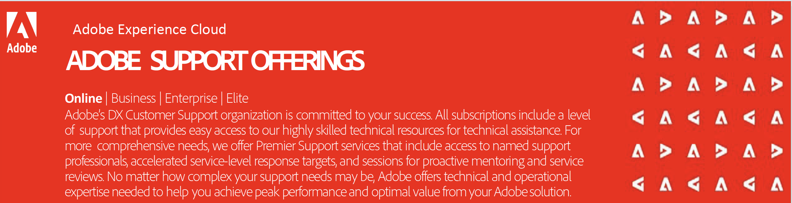

# Online

<table>
<thead>
  <tr>
    <th></th>
    <th></th>
    <th>Online Support</th>
    <th>Business Support</th>
    <th>Enterprise Support</th>
    <th>Elite Support</th>
  </tr>
</thead>
<tbody>
  <tr>
    <td></td>
    <td></td>
    <td>Included with Subscription</td>
    <td colspan="3">Premier Support Levels ($)</td>
  </tr>
  <tr>
    <td rowspan="3">Assigned Experts </td>
    <td>Account Support Lead</td>
    <td></td>
    <td>✔</td>
    <td></td>
    <td></td>
  </tr>
  <tr>
    <td>Named Support Engineer</td>
    <td></td>
    <td></td>
    <td>✔</td>
    <td>✔</td>
  </tr>
  <tr>
    <td>Technical Account Manager</td>
    <td></td>
    <td></td>
    <td></td>
    <td>✔</td>
  </tr>
  <tr>
    <td rowspan="10">Support Services</td>
    <td>Base Support</td>
    <td>Business hours</td>
    <td>Business hours</td>
    <td>24x5</td>
    <td>24x5</td>
  </tr>
  <tr>
    <td>24x7x365 P1 Issue Support</td>
    <td>✔</td>
    <td>✔</td>
    <td>✔</td>
    <td>✔</td>
  </tr>
  <tr>
    <td>Named Support Contacts (per product)</td>
    <td>4</td>
    <td>6</td>
    <td>10</td>
    <td>15</td>
  </tr>
  <tr>
    <td>Phone Case Submission</td>
    <td></td>
    <td>✔</td>
    <td>✔</td>
    <td>✔</td>
  </tr>
  <tr>
    <td>Escalation Management</td>
    <td></td>
    <td>✔</td>
    <td>✔</td>
    <td>✔</td>
  </tr>
  <tr>
    <td>Service Reviews &amp; Expert Sessions perYear</td>
    <td></td>
    <td></td>
    <td>2</td>
    <td>4</td>
  </tr>
  <tr>
    <td>EventManagement</td>
    <td></td>
    <td></td>
    <td></td>
    <td>✔</td>
  </tr>
  <tr>
    <td>Environment Review, Maintenance &amp; Monitoring</td>
    <td></td>
    <td></td>
    <td></td>
    <td>✔</td>
  </tr>
  <tr>
    <td>Release, Migration, Upgrade &amp; Product Roadmap Review</td>
    <td></td>
    <td></td>
    <td></td>
    <td>✔</td>
  </tr>
  <tr>
    <td>Cloud Support Activities – Experience Manager as Cloud</td>
    <td></td>
    <td></td>
    <td>✔</td>
    <td>✔</td>
  </tr>
  <tr>
    <td rowspan="2">Field Services</td>
    <td>Launch Advisory Services – First Year of new solution</td>
    <td></td>
    <td></td>
    <td>✔</td>
    <td>✔</td>
  </tr>
  <tr>
    <td>Field Service Activities (services menu)</td>
    <td></td>
    <td></td>
    <td>2</td>
    <td>4</td>
  </tr>
</tbody>
</table>

## Service Level Targets: Initial Response

|Priority | Online Support | Business Support | Enterprise Support | Elite Support |
|--- |--- |--- |--- |--- |
|<b>PRIORITY 1</b> Customer's business has a substantial loss or degradation of mission critical data or services being unavailable and no work around exists (some solutions require submission by phone) | 24x7/ 1 hour | 24x7/ 1 hour | 24x7/ 30 minutes | 24x7/ 15 minutes |
|<b>PRIORITY 2</b> Customer's business has moderate loss or degradation of data or services being unavailable and no long-term acceptable workaround exists.| Business  hours/ 4hours | Business hours/ 2 hours | 24x5/ 1 hour | 24x5/ 30 minutes |
|<b>PRIORITY 3</b> Customer's business has minimal loss or degradation of data or services being unavailable and a workaround exists | Business hours/ 6 hours | Business hours/  4 hours | Business hours/ 2 hours | 24x5/ 1 hour |
|<b>PRIORITY 4</b> Enhancement request or general question | Business days/ 3 days | Business day/ 1 day | Business day/  1 day | Business day/  1 day |

{style="table-layout:auto"}

## Base/Online Support

Adobe Customer Support offers access to online resources for documentation, engagement with other experts and customers for best practices, and webinar series (Office Hours) for troubleshooting tips and tricks. Several channels are also available for questions and case submissions.

assets/forums.png

<table style="table-layout:fixed">
<tr>
  <td>
    
    

    
Community Forums

    
<b>Online Forums</b>

    
Continuous online access to a growing database of technical solutions, product documentation, FAQs and more. Thousands of customers can connect on Adobe Community to share best practices and lessons learned.

    

  </td>
  <td>
    
    

    
Office Hours

    
<b>Webinars</b>

    
Office Hours is an initiative led by the Adobe Customer Support team. These sessions are designed to inform as well as help participants troubleshoot problems and provide tips and tricks to be successful with Adobe Experience Cloud.

    

  </td>
</tr>
<tr>
  <td>
    
    

    
Experience League

    
<b>Self-guided Journeys</b>

    
Experience Makers are made with Experience League. Customers can kickstart their Customer Experience Management abilities with personalized learning to develop skills, engage with a global community of peers, and earn career advancing recognition.

    

  </td>
  <td>
    
    

    
Self-help Portals

    
<b>24/7 Support Portal</b>

    
On-demand access to the online Self-help Support Portal to submit support requests, review case status, and browse other resources, like our knowledgebase, news and alerts, featured tips, and more.

    

  </td>
</tr>
<tr>
  <td>
    
    

    
Live Chat Support *

    
<b>Chat Support</b>

    
Start a chat session to get answers & help with case submission.

    

  </td>
  <td>
    
    

    
24x7x365 P1

    
<b>Phone Support</b>

    
Supported Users (authorized to interact with support) system can talk to an Adobe expert.

    

  </td>
</tr>
</table>

*Not all products have live chat support.

## Resources

|Resource | Description |
|--- |--- |
|[Experience League](https://experienceleague.adobe.com/) | Experience League is how Adobe helps businesses achieve the value they expect from their Adobe investment. It’s the unified place where customers can learn, connect, and grow along a personalized path to success that includes self-help tutorials, product documentation, instructor-led training, community and technical support.|
|[Training](https://training.adobe.com/training/) | Adobe Digital Learning Services courses are accessible from Experience League. Learning courses integrate both on-demand and instructor-led lessons. Here you can accrue skills that have recognized market value and position them to drive success in your organizations.|
|[Production issues & system outages](https://status.adobe.com/) | Status.adobe.com conveys the health information of all Adobe products and services that are deployed in multi-tenant environments. Customers can choose their subscription preferences to get email notifications whenever Adobe creates, updates or resolves a product event. This can include scheduled maintenance or service issues of varying levels of severity.|
|[Office Hours](https://helpx.adobe.com/customer-care-office-hours.html) | Office hour sessions provide live, educational trainings and solution-specific tips for success with Adobe Experience Cloud solutions.|
|[Terms and Conditions](https://helpx.adobe.com/support/programs/support-policies-terms-conditions.html) | A detailed description of Adobe Support |

## Regional Hours Of Operation And Language Support

Adobe's local business hours align to the customer’s billing region.

| North America | Europe, Middle East & Africa | Asia Pacific | Japan |
|--- |--- |--- |--- |
| 6 am – 5:30 pm | 9 am – 5 pm | 9 am – 5 pm | 9 am – 5:30 pm |

*Language support only available in English and Japanese.*

