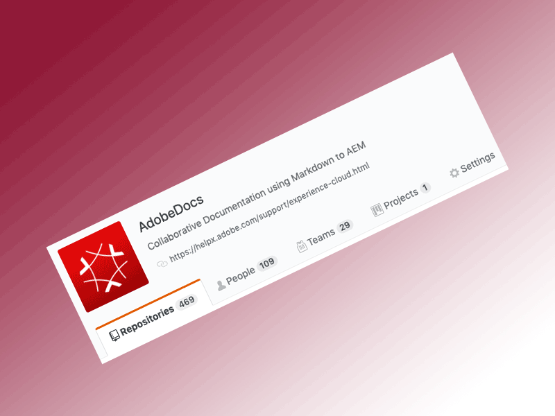

# Support Data Sheets Overview

Welcome to the something user guide.

MORE...

<table style="table-layout:fixed">
<tr>
  <td>
    
    

    <a href="online.md"><strong>Online</strong></a>
    

    <em>View <a href="assets/OnlineSupportDatasheet.pdf" target="_blank"><strong>Online PDF</strong></a></em>
     
  </td>
  <td>
    
    

    <a href="business.md"><strong>Business</strong></a>
    

    <em>View <a href="assets/BusinessSupportDatasheet.pdf" target="_blank"><strong>Business PDF</strong></a></em>
     
  </td>
</tr>
<tr>
  <td>
    
    

    <a href="enterprise.md"><strong>Enterprise</strong></a>
    

    <em>View <a href="assets/EnterprisePremierSupportDatasheet.pdf" target="_blank"><strong>Enterprise PDF</strong></a></em>
     
  </td>
  <td>
    
    

    <a href="elite.md"><strong>Elite</strong></a>
    

    <em>View <a href="assets/ElitePremierSupportDatasheet.pdf" target="_blank"><strong>Elite PDF</strong></a></em>
     
  </td>
</tr>
</table>

<!--
This is the landing page of the user guide. It should be the first list item in the TOC.md file.

See other user landing pages to get ideas.
-->
