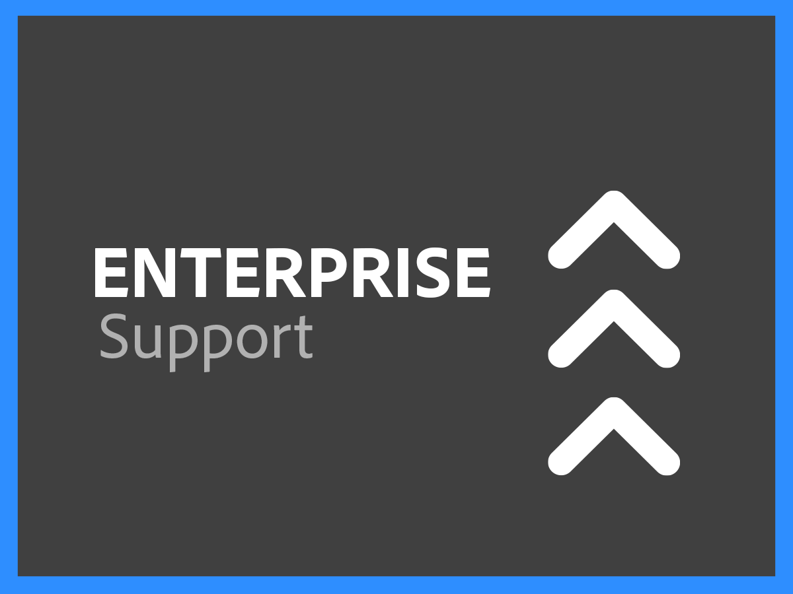
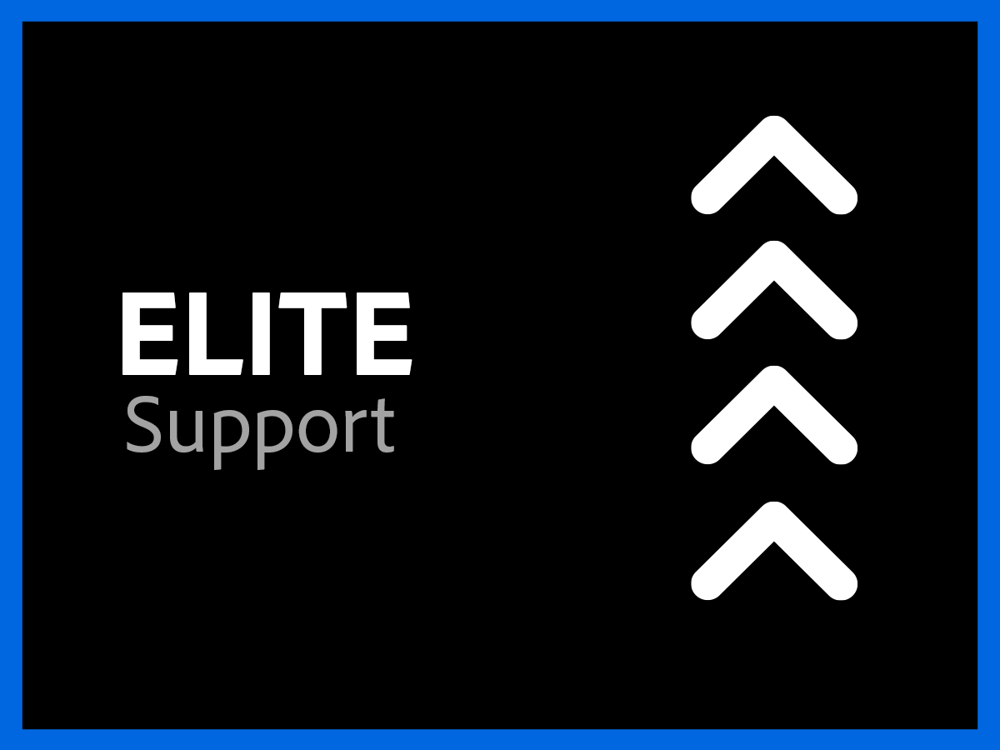

# Support Data Sheets Overview

Adobe's DX Customer Support organization is committed to your success. All subscriptions include a level of support that provides easy access to our highly skilled technical resources for technical assistance. 

For more comprehensive needs, we offer Adobe Support services that include access to named support professionals, accelerated service-level response targets, and sessions for proactive mentoring and service reviews. No matter how complex your support needs may be, Adobe offers technical and operational expertise needed to help you achieve peak performance and optimal value from your Adobe solution.

<table style="table-layout:fixed">
<tr>
  <td>
    
    

    <a href="online.md"><strong>Online Support</strong></a> (view <a href="assets/OnlineSupportDatasheet.pdf" target="_blank">PDF</a>)
    

    
Included with subscription, limited access to phone support

     
  </td>
  <td>
    
    

    <a href="business.md"><strong>Business Support</strong></a> (view <a href="assets/BusinessSupportDatasheet.pdf" target="_blank">PDF</a>)
    

    
Complete access to Adobe's technical support teams and to an Account Support Lead for account management

     
  </td>
</tr>
<tr>
  <td>
    
    

    <a href="enterprise.md"><strong>Enterprise Support</strong></a> (view <a href="assets/EnterpriseSupportDatasheet.pdf" target="_blank">PDF</a>)
    

    
Enhanced support Service Level Targets (SLTs), benefits of technical expertise and an advocate in the form of a Named Support Engineer

     
  </td>
  <td>
    
    

    <a href="elite.md"><strong>Elite Support</strong></a> (view <a href="assets/EliteSupportDatasheet.pdf" target="_blank">PDF</a>)
    

    
Best-in-class Service Level Targets (SLTs), proactive support and partnership with a Technical Account Manager and a Named Support Engineer

     
  </td>
</tr>
</table>
